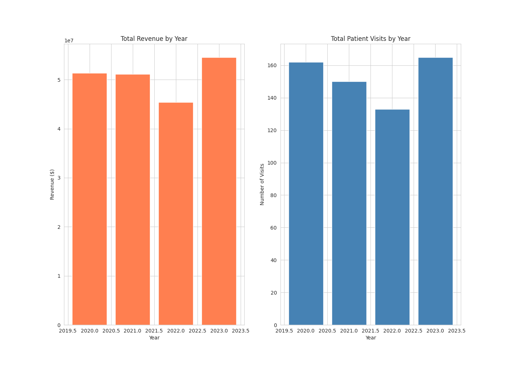
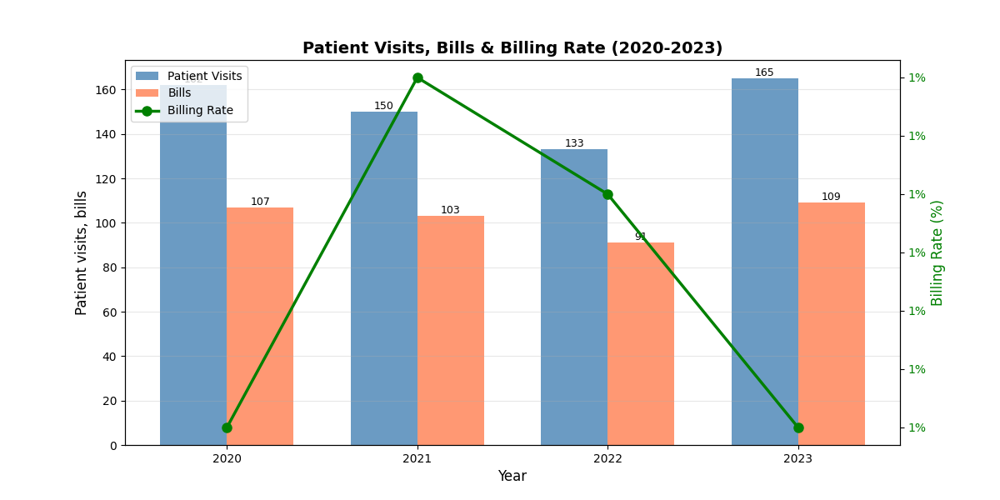
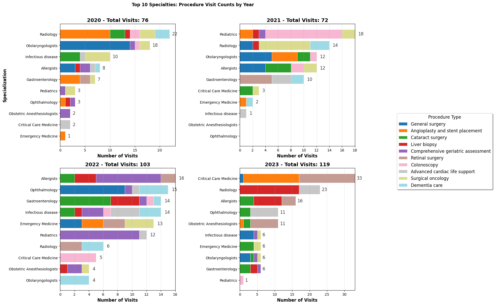

# Healthcare BI Analysis

## Table of contents
- [Project Overview](#project_overview)
- [Data Prerequisites](#data_prerequisites)
- [Data Extraction Loading and Transformation](#data_extraction_loading_and_transformation)
- [Analytics & Visualization](#analytics_and_visualization)
- [Addressed Questions](#key_questions_being_addressed_by_eda)
- [Results & Findings](#results_and_findings)
- [Recommendation](#recommendation)
- [Limitations](#limitations)

### Project Overview

This project will provide insights on the operations of a healthcare facility and also tacle different emerging issues facing healthcare facilities when it comes to resource allocation. The analysis of the healthcare business is crucial to enable continuous provision of not only good healthcare services but also affordable and reliable healthcare services. Therefore, it's important for healthcare companies to strategize and conduct proper resource planning using data to ensure they are working optimally.


### Data Prerequisites

- Data source: Healthcare data: [Healthcare Management System_Data](https://www.kaggle.com/datasets/anouskaabhisikta/healthcare-management-system/data)
- Analytics Tool: Python - Data ETL, Exploratory Analysis and Data Visualization

### Data Extraction, Loading and Transformation [Python](dataanalysis_health.py)

Performed the following tasks: 
1. Data Loading
   ```python
   import kagglehub; print('kagglehub imported successfully')
   from kagglehub import KaggleDatasetAdapter
   ```
3. Data Cleaning and inspection
4. Merging and joining of datasets
5. Handling missing values

### Analytics and Visualization [Python](dataanalysis_health.py)

1. Exploratory Data Analysis
   - Total Revenue, Visits, Revenue per Visit, Growth rates     
2. Data Visualization
   - Revenue Trends, Visits trends, Billing rates

### Key questions being adressed by EDA

- What is the total visits of patients being billed?
- What percentage of visits are billable?
- What is the revenue and cost implicated?
- What is the distribution per service and per billing?
- Which service has low and high billing rate?

### Results and Findings

## Tables

### Revenue Performance With Growth Rates
|   Year | total_revenue   |   total_patient_visits |   total_bills | billing_rate   | revenue_per_visit   |   revenue_growth |   visits_growth |
|--------|-----------------|------------------------|---------------|----------------|---------------------|------------------|-----------------|
|   2020 | $51,373,131     |                    162 |           107 | 66.0%          | $480,123            |            nan   |             nan |
|   2021 | $51,108,131     |                    150 |           103 | 69.0%          | $496,195            |             -0.5 |              -7 |
|   2022 | $45,386,523     |                    133 |            91 | 68.0%          | $498,753            |            -10   |             -10 |
|   2023 | $54,579,158     |                    165 |           109 | 66.0%          | $500,726            |             20   |              20 |

## Charts
### Healthcare Trends (2020 - 2023) - Visits, Revenue

### Billing rate of actual visits (2020 - 2023)

### Top Specialization Visits per year (2020 - 2023)

### Top Revenue and Revenue per Visit by specialization (2020 - 2023)

### Summary 
The analysis results were as follows:
1. The healthcare facility had the lowest revenue in the year with the lowest billing
2. The was a consistent decline in revenue in 2021 o 2022 due to .... compared to 2023 where...
3. The speciality with the highest visits was ....

### Recommendation
#### Based on the analysis conducted, I would recommend the following:
- 
- 

### Limitations
- The zero values in PatientsID were removed since they are considured as no visits

### References
- Kaggle


