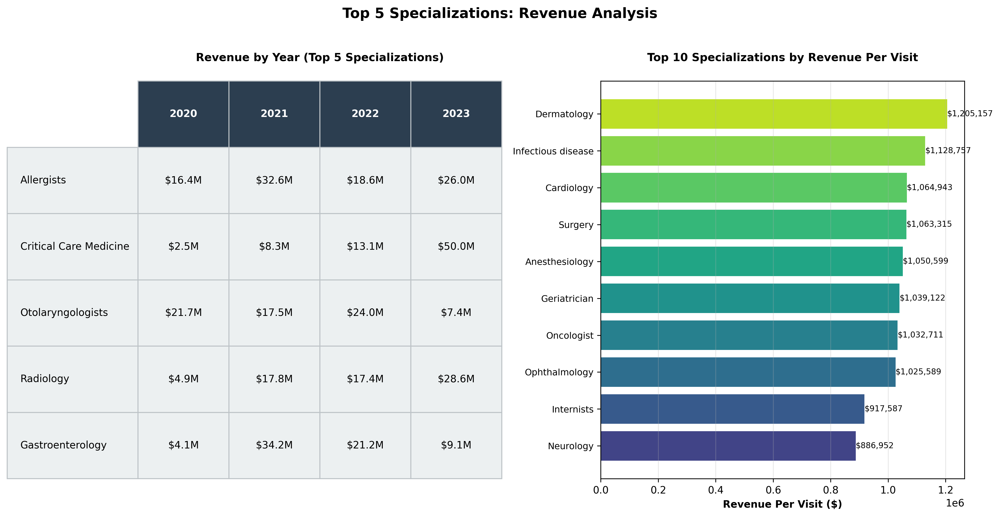

# Healthcare BI Analysis

## Table of contents
- [Project Overview](#project_overview)
- [Data Prerequisites](#data_prerequisites)
- [Data Extraction Loading and Transformation](#data_extraction_loading_and_transformation)
- [Analytics & Visualization](#analytics_and_visualization)
- [Addressed Questions](#key_questions_being_addressed_by_eda)
- [Results & Findings](#results_and_findings)
- [Recommendation](#recommendation)
- [Limitations](#limitations)

### Project Overview

This project will provide insights on the operations of a healthcare facility and also tacle different emerging issues facing healthcare facilities when it comes to resource allocation. The analysis of the healthcare business is crucial to enable continuous provision of not only good healthcare services but also affordable and reliable healthcare services. Therefore, it's important for healthcare companies to strategize and conduct proper resource planning using data to ensure they are working optimally.


### Data Prerequisites

- Data source: Healthcare data: [Healthcare Management System_Data](https://www.kaggle.com/datasets/anouskaabhisikta/healthcare-management-system/data)
- Analytics Tool: Python - Data ETL, Exploratory Analysis and Data Visualization

### Data Extraction, Loading and Transformation [Python](dataanalysis_health.py)

Performed the following tasks: 
1. Data Loading
   ```python
   import kagglehub; print('kagglehub imported successfully')
   from kagglehub import KaggleDatasetAdapter
   ```
2. Data Inspection and Cleaning
   ```python
   for file_name,df in dfs.items():
    print(f"{file_name}: listcolumns={df.columns}")

   from itertools import combinations # for comparing all pairs of columns across tables
   from difflib import SequenceMatcher # for fuzzy string matching 
   
   print("FINDING SIMILAR COLUMNS ACROSS DATASETS")
   print("-"*60) # separator for clarity in output

   all_columns = {table: set(df.columns) for table, df in dfs.items()}

   print("\n>>> ALL UNIQUE COLUMN NAMES")
   all_cols = sorted(set().union(*all_columns.values()))
   for col in all_cols:
    print(f"  {col}")

   print("\n>>> EXACT MATCHES (columns with same name)")
   print("-" * 60)
   for col in all_cols:
    tables = [t for t, cols in all_columns.items() if col in cols]
    if len(tables) > 1:
        print(f"\n  Column: '{col}'")
        print(f"  Found in: {', '.join(tables)}")
        for table in tables:
            sample = dfs[table][col].dropna().head(2).tolist()
            print(f"    {table}: {sample}")
   ```
3. Merging and joining of datasets
   ```python
   appointments_patientdoc_df = appointments.merge(patients, on= 'PatientID', how= 'outer').merge(doctors, on='DoctorID', how='outer')
   appointments_procedure_df = appointments_patientdoc_df.merge(procedures, on= 'AppointmentID', how= 'left').merge(billings, on= 'PatientID', how= 'left')
   ```
4. Handling missing values
   ```python
   appointments_procedure_cln = appointments_procedure_df.drop(columns=columns_to_drop).dropna(subset=['AppointmentID']) # Drop rows with missing key IDs
   ```

### Analytics and Visualization [Python](dataanalysis_health.py)

1. Exploratory Data Analysis
   - Total Revenue, Visits, Revenue per Visit, Growth rates     
2. Data Visualization
   - Revenue Trends, Visits trends, Billing rates

### Key questions being adressed by EDA

- What is the total visits of patients being billed?
- What percentage of visits are billable?
- What is the revenue and cost implicated?
- What is the distribution per service and per billing?
- Which service has low and high billing rate?

### Results and Findings

## Tables

### Revenue Performance With Growth Rates
|   Year | total_revenue   |   total_patient_visits |   total_bills | billing_rate   | revenue_per_visit   |   revenue_growth |   visits_growth |
|--------|-----------------|------------------------|---------------|----------------|---------------------|------------------|-----------------|
|   2020 | $51,373,131     |                    162 |           107 | 66.0%          | $480,123            |            nan   |             nan |
|   2021 | $51,108,131     |                    150 |           103 | 69.0%          | $496,195            |             -0.5 |              -7 |
|   2022 | $45,386,523     |                    133 |            91 | 68.0%          | $498,753            |            -10   |             -10 |
|   2023 | $54,579,158     |                    165 |           109 | 66.0%          | $500,726            |             20   |              20 |


## Charts
### Healthcare Trends (2020 - 2023) - Visits, Revenue

### Billing rate of actual visits (2020 - 2023)

### Top Specialization Visits per year (2020 - 2023)

### Top Revenue and Cost per Visit by specialization (2020 - 2023)


### Summary 
The analysis results were as follows:
1. The healthcare facility had a consistent decline in revenue and visits from 2020 to 2022 but registered a sharp increase of 20% in 2023.
2. It is evident that the billing rate of the patients booked has no direct correlation with the growth in revenue or visits, the performance of the facility is significantly influenced by the number of patients visits and the cost of service.
- As observed in 2023, the facility had **66% billing rate** of appointments (which is the lowest across all the years) but registered the highest growth rate due to its high cost per vist and patient visits.
3. The overall top services most requested for in the 4 years were: Radiology, Allergists and Gastroenterology. Concurrently, the 
- These services had the high visits with relatively low cost apart from Gastroenterology.

### Recommendation
#### Based on the analysis conducted, I would recommend the following:
- The facility should consider increasing marketing of their top services and procedures to attract more visits.
- The cost per service can also be reviewed downwards to increase the number of visits

### Limitations
- The null values on primary keys were exempted from the analysis
- The analysis is a year on year (YoY) which is biased compared to a Month on Month time series analysis

### References
- Secondary data of the healthcare facility was sourced from Kaggle 
- AI tools and Python documentation was used to write and revise the python codes


